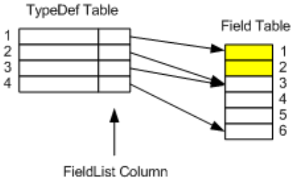

## II.22.15 Field: 0x04

The _Field_ table has the following columns:

 * _Flags_ (a 2-byte bitmask of type _FieldAttributes_, §[II.23.1.5](ii.23.1.5-flags-for-fields-fieldattributes.md))

 * _Name_ (an index into the String heap)

 * _Signature_ (an index into the Blob heap)

Conceptually, each row in the _Field_ table is owned by one, and only one, row in the _TypeDef_ table. However, the owner of any row in the _Field_ table is not stored anywhere in the _Field_ table itself. There is merely a 'forward-pointer' from each row in the _TypeDef_ table (the _FieldList_ column), as shown in the following illustration.

 

The _TypeDef_ table has rows 1&ndash;4. The first row in the _TypeDef_ table corresponds to a pseudo type, inserted automatically by the CLI. It is used to denote those rows in the _Field_ table corresponding to global variables. The _Field_ table has rows 1&mdash;6. Type 1 (pseudo type for 'module') owns rows 1 and 2 in the _Field_ table. Type 2 owns no rows in the _Field_ table, even though its _FieldList_ indexes row 3 in the _Field_ table. Type 3 owns rows 3&mdash;5 in the _Field_ table. Type 4 owns row 6 in the _Field_ table.  So, in the _Field_ table, rows 1 and 2 belong to Type 1 (global variables); rows 3&mdash;5 belong to Type 3; row 6 belongs to Type 4.

Each row in the _Field_ table results from a top-level **.field** directive (§[II.5.10](ii.5.10-ilasm-source-files.md)), or a **.field** directive inside a Type (§[II.10.2](#todo-missing-hyperlink)). (For an example, see §[II.14.5](#todo-missing-hyperlink).)

> _This contains informative text only._

 1. The _Field_ table can contain zero or more rows

 2. Each row shall have one, and only one, owner row in the _TypeDef_ table \[ERROR\]

 3. The owner row in the _TypeDef_ table shall not be an Interface \[CLS\]

 4. _Flags_ shall have only those values set that are specified \[ERROR\]

 5. The `FieldAccessMask` subfield of _Flags_ shall contain precisely one of `CompilerControlled`, `Private`, `FamANDAssem`, `Assembly`, `Family`, `FamORAssem`, or `Public` (§[II.23.1.5](ii.23.1.5-flags-for-fields-fieldattributes.md)) \[ERROR\]

 6. _Flags_ can set either or neither of `Literal` or `InitOnly`, but not both (§[II.23.1.5](ii.23.1.5-flags-for-fields-fieldattributes.md)) \[ERROR\]

 7. If _Flags_.`Literal` = 1 then _Flags_.`Static` shall also be 1 (§[II.23.1.5](ii.23.1.5-flags-for-fields-fieldattributes.md)) \[ERROR\]

 8. If _Flags_.`RTSpecialName` = 1, then _Flags_.`SpecialName` shall also be 1 (§[II.23.1.5](ii.23.1.5-flags-for-fields-fieldattributes.md)) \[ERROR\]

 9. If _Flags_.`HasFieldMarshal` = 1, then this row shall 'own' exactly one row in the _FieldMarshal_ table (§[II.23.1.5](ii.23.1.5-flags-for-fields-fieldattributes.md)) \[ERROR\]

 10. If _Flags_.`HasDefault` = 1, then this row shall 'own' exactly one row in the _Constant_ table (§[II.23.1.5](ii.23.1.5-flags-for-fields-fieldattributes.md) \[ERROR\]

 11. If _Flags_.`HasFieldRVA` = 1, then this row shall 'own' exactly one row in the _Field's RVA_ table (§[II.23.1.5](ii.23.1.5-flags-for-fields-fieldattributes.md)) \[ERROR\]

 12. _Name_ shall index a non-empty string in the String heap \[ERROR\]

 13. The _Name_ string shall be a valid CLS identifier \[CLS\]

 14. _Signature_ shall index a valid field signature in the Blob heap \[ERROR\]

 15. If _Flags_.`CompilerControlled` = 1 (§[II.23.1.5](ii.23.1.5-flags-for-fields-fieldattributes.md)), then this row is ignored completely in duplicate checking.

 16. If the owner of this field is the internally-generated type called `<Module>`, it denotes that this field is defined at module scope (commonly called a global variable). In this case:

     * _Flags_.`Static` shall be 1 \[ERROR\] 

     * _Flags_.`MemberAccessMask` subfield shall be one of `Public`, `CompilerControlled`, or `Private` (§[II.23.1.5](ii.23.1.5-flags-for-fields-fieldattributes.md)) \[ERROR\]

     * module-scope fields are not allowed  \[CLS\]

 17. There shall be no duplicate rows in the _Field_ table, based upon _owner_+_Name_+_Signature_ (where _owner_ is the owning row in the _TypeDef_ table, as described above) (Note however that if _Flags_.`CompilerControlled` = 1, then this row is completely excluded from duplicate checking) \[ERROR\]

 18. There shall be no duplicate rows in the _Field_ table, based upon _owner_+_Name_, where _Name_ fields are compared using CLS conflicting-identifier-rules. So, for example,"`int i`" and "`float i`" would be considered CLS duplicates. (Note however that if _Flags_.`CompilerControlled` = 1, then this row is completely excluded from duplicate checking, as noted above) \[CLS\]

 19. If this is a field of an Enum then: 
 
     * owner row in _TypeDef_ table shall derive directly from `System.Enum` \[ERROR\]

     * the owner row in _TypeDef_ table shall have no other instance fields \[CLS\]

     * its _Signature_ shall be one of `ELEMENT_TYPE_U1`, `ELEMENT_TYPE_I2`, `ELEMENT_TYPE_I4`, or `ELEMENT_TYPE_I8` (§[II.23.1.16](ii.23.1.16-element-types-used-in-signatures.md)) \[CLS\]

 20. its _Signature_ shall be an integral type. \[ERROR\]

> _End informative text._
