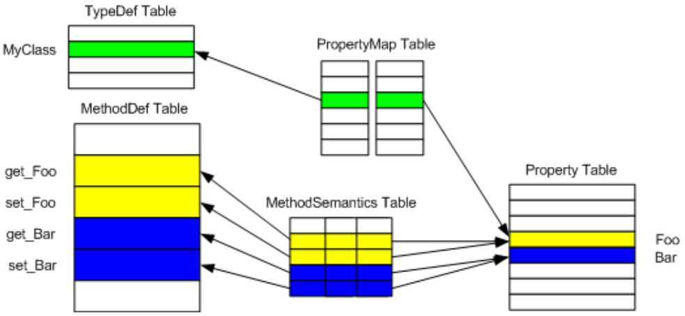

## II.22.34 Property: 0x17

Properties within metadata are best viewed as a means to gather together collections of methods defined on a class, give them a name, and not much else. The methods are typically *get_* and *set_* methods, already defined on the class, and inserted like any other methods into the _MethodDef_ table. The association is held together by three separate tables, as shown below:

 

Row 3 of the _PropertyMap_ table indexes row 2 of the _TypeDef_ table on the left (`MyClass`), whilst indexing row 4 of the _Property_ table on the right &ndash; the row for a property called Foo.  This setup establishes that `MyClass` has a property called `Foo`. But what methods in the _MethodDef_ table are gathered together as 'belonging' to property `Foo`? That association is contained in the _MethodSemantics_ table &ndash; its row 2 indexes property `Foo` to the right, and row 2 in the _MethodDef_ table to the left (a method called `get_Foo`). Also, row 3 of the _MethodSemantics_ table indexes `Foo` to the right, and row 3 in the _MethodDef_ table to the left (a method called `set_Foo`). As the shading suggests, `MyClass` has another property, called `Bar`, with two methods, `get_Bar` and `set_Bar`.

Property tables do a little more than group together existing rows from other tables. The _Property_ table has columns for _Flags_, _Name_ (eg `Foo` and `Bar` in the example here) and _Type_. In addition, the _MethodSemantics_ table has a column to record whether the method it points at is a *set_*, a *get_* or *other*.

_[Note:_ The CLS (see Partition I) refers to instance, virtual, and static properties. The signature of a property (from the _Type_ column) can be used to distinguish a static property, since instance and virtual properties will have the "`HASTHIS`" bit set in the signature (§[II.23.2.1](ii.23.2.1-methoddefsig.md)) while a static property will not. The distinction between an instance and a virtual property depends on the signature of the getter and setter methods, which the CLS requires to be either both virtual or both instance. _end note]_

The _Property_ (0x17) table has the following columns:

 * _Flags_ (a 2-byte bitmask of type _PropertyAttributes_, §II.23.1.14)

 * _Name_ (an index into the String heap)
 
 * _Type_ (an index into the Blob heap) (The name of this column is misleading.  It does not index a _TypeDef_ or _TypeRef_ table&mdash;instead it indexes the signature in the Blob heap of the Property)

> _This contains informative text only._

 1. _Property_ table can contain zero or more rows

 2. Each row shall have one, and only one, owner row in the _PropertyMap_ table (as described above) \[ERROR\]

 3. _PropFlags_ shall have only those values set that are specified (all combinations valid) \[ERROR\]

 4. _Name_ shall index a non-empty string in the String heap \[ERROR\]

 5. The _Name_ string shall be a valid CLS identifier \[CLS\]

 6. _Type_ shall index a non-null signature in the Blob heap \[ERROR\]

 7. The signature indexed by _Type_ shall be a valid signature for a property (ie, low nibble of leading byte is 0x8). Apart from this leading byte, the signature is the same as the property's *get_* method  \[ERROR\]

 8. Within the rows owned by a given row in the _TypeDef_ table, there shall be no duplicates based upon _Name_+_Type_ \[ERROR\]

 9. There shall be no duplicate rows based upon _Name_, where _Name_ fields are compared using CLS conflicting-identifier-rules (in particular, properties cannot be overloaded by their Type &ndash; a class cannot have two properties, "`int Foo`" and "`String Foo`", for example) \[CLS\]

> _End informative text._
