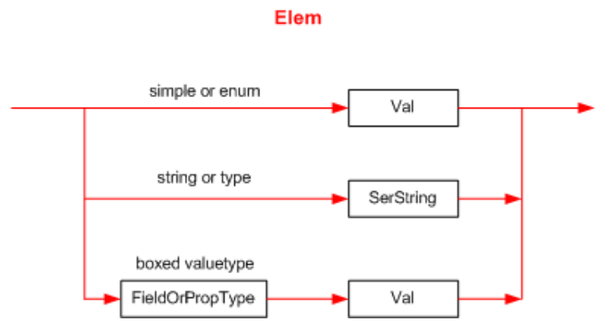

## II.23.3 Custom attributes

A Custom Attribute has the following syntax diagram:

 

All binary values are stored in little-endian format (except _PackedLen_ items, which are used only as counts for the number of bytes to follow in a UTF8 string). If there are no fields, parameters, or properties specified the entire attribute is represented as an empty blob.

_CustomAttrib_ starts with a Prolog &ndash; an unsigned *int16*, with value 0x0001.

Next comes a description of the fixed arguments for the constructor method. Their number and type is found by examining that constructor's row in the _MethodDef_ table; this information is not repeated in the _CustomAttrib_ itself. As the syntax diagram shows, there can be zero or more _FixedArgs_. (Note that `VARARG` constructor methods are not allowed in the definition of Custom Attributes.)

Next is a description of the optional "named" fields and properties. This starts with _NumNamed_ &ndash; an unsigned int16 giving the number of "named" properties or fields that follow. Note that _NumNamed_ 
shall always be present. A value of zero indicates that there are no "named" properties or fields to follow (and of course, in this case, the _CustomAttrib_ shall end immediately after _NumNamed_). In the case where _NumNamed_ is non-zero, it is followed by _NumNamed_ repeats of _NamedArgs_.

 

The format for each _FixedArg_ depends upon whether that argument is an `SZARRAY` or not &ndash; this is shown in the lower and upper paths, respectively, of the syntax diagram. So each _FixedArg_ is either a single _Elem_, or _NumElem_ repeats of _Elem_.

(`SZARRAY` is the single byte 0x1D, and denotes a vector &ndash; a single-dimension array with a lower bound of zero.)

_NumElem_ is an unsigned _int32_ specifying the number of elements in the `SZARRAY`, or 0xFFFFFFFF to indicate that the value is null.

 

An _Elem_ takes one of the forms in this diagram, as follows:

 * If the parameter kind is simple (first line in the above diagram) (**bool**, **char**, **float32**, **float64**, **int8**, **int16**, **int32**, **int64**, **unsigned int8**, **unsigned int16**, **unsigned int32** or **unsigned int64**) then the 'blob' contains its binary value (_Val_). (A *bool* is a single byte with value 0 (false) or 1 (true); *char* is a two-byte Unicode character; and the others have their obvious meaning.) This pattern is also used if the parameter kind is an *enum* &ndash; simply store the value of the enum's underlying integer type.

 * If the parameter kind is _string_, (middle line in above diagram) then the blob contains a _SerString_ &ndash; a _PackedLen_ count of bytes, followed by the UTF8 characters. If the string is null, its _PackedLen_ has the value 0xFF (with no following characters). If the string is empty (""), then _PackedLen_ has the value 0x00 (with no following characters).

 * If the parameter kind is `System.Type`, (also, the middle line in above diagram) its value is stored as a _SerString_ (as defined in the previous paragraph), representing its canonical name. The canonical name is its full type name, followed optionally by the assembly where it is defined, its version, culture and public-key-token. If the assembly name is omitted, the CLI looks first in the current assembly, and then in the system library (`mscorlib`); in these two special cases, it is permitted to omit the assembly-name, version, culture and public-key-token.

 * If the parameter kind is `System.Object`, (third line in the above diagram) the value stored represents the "boxed" instance of that value-type.  In this case, the blob contains the actual type's _FieldOrPropType_ (see below), followed by the argument's unboxed value. _[Note:_ it is not possible to pass a value of null in this case. _end note]_

 * If the type is a boxed simple value type (**bool**, **char**, **float32**, **float64**, **int8**, **int16**, **int32**, **int64**, **unsigned int8**, **unsigned int16**, **unsigned int32** or **unsigned int64**) then _FieldOrPropType_ is immediately preceded by a byte containing the value 0x51 . The _FieldOrPropType_ shall be exactly one of: `ELEMENT_TYPE_BOOLEAN`, `ELEMENT_TYPE_CHAR`, `ELEMENT_TYPE_I1`, `ELEMENT_TYPE_U1`, `ELEMENT_TYPE_I2`, `ELEMENT_TYPE_U2`, `ELEMENT_TYPE_I4`, `ELEMENT_TYPE_U4`, `ELEMENT_TYPE_I8`, `ELEMENT_TYPE_U8`, `ELEMENT_TYPE_R4`, `ELEMENT_TYPE_R8`, `ELEMENT_TYPE_STRING`. A single-dimensional, zero-based array is specified as a single byte 0x1D followed by the _FieldOrPropTypeof_ the element type. (See §[II.23.1.16](#todo-missing-hyperlink))  An enum is specified as a single byte 0x55 followed by a _SerString_.

 

A _NamedArg_ is simply a _FixedArg_ (discussed above) preceded by information to identify which field or property it represents. _[Note:_ Recall that the CLI allows fields and properties to have the same name; so we require a means to disambiguate such situations. _end note]_

 * `FIELD` is the single byte 0x53.

 * `PROPERTY` is the single byte 0x54.

The _FieldOrPropName_ is the name of the field or property, stored as a _SerString_ (defined above). A number of examples involving custom attributes are contained in [Annex B of Partition VI](#todo-missing-hyperlink).
